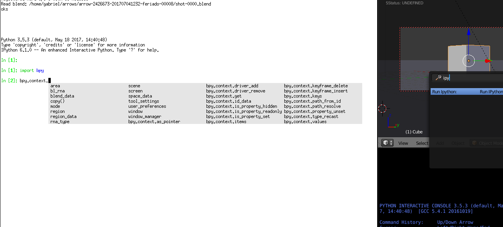

Run IPython from Blender
========================

Requires Blender's Python to have access to IPython.

You can, for example, 

----
'/INSTALLED_BLENDER_PATH/2.XX/python/bin/python3.7m' -m ensurepip
'/INSTALLED_BLENDER_PATH/2.XX/python/bin/python3.7m' -m pip install ipython
----

To use: 

* Space to bring up the search, and find 'Run IPython in console'
* On the console from which you started blender, you'll get the IPython console---the UI will stop rendering until you're done, exit the console and return the control to the blender UI.

